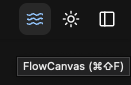
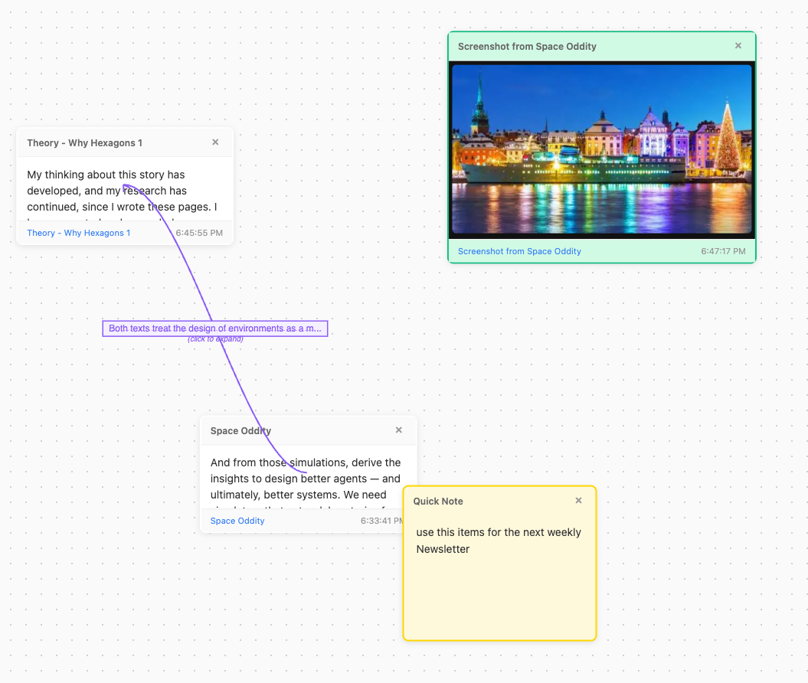
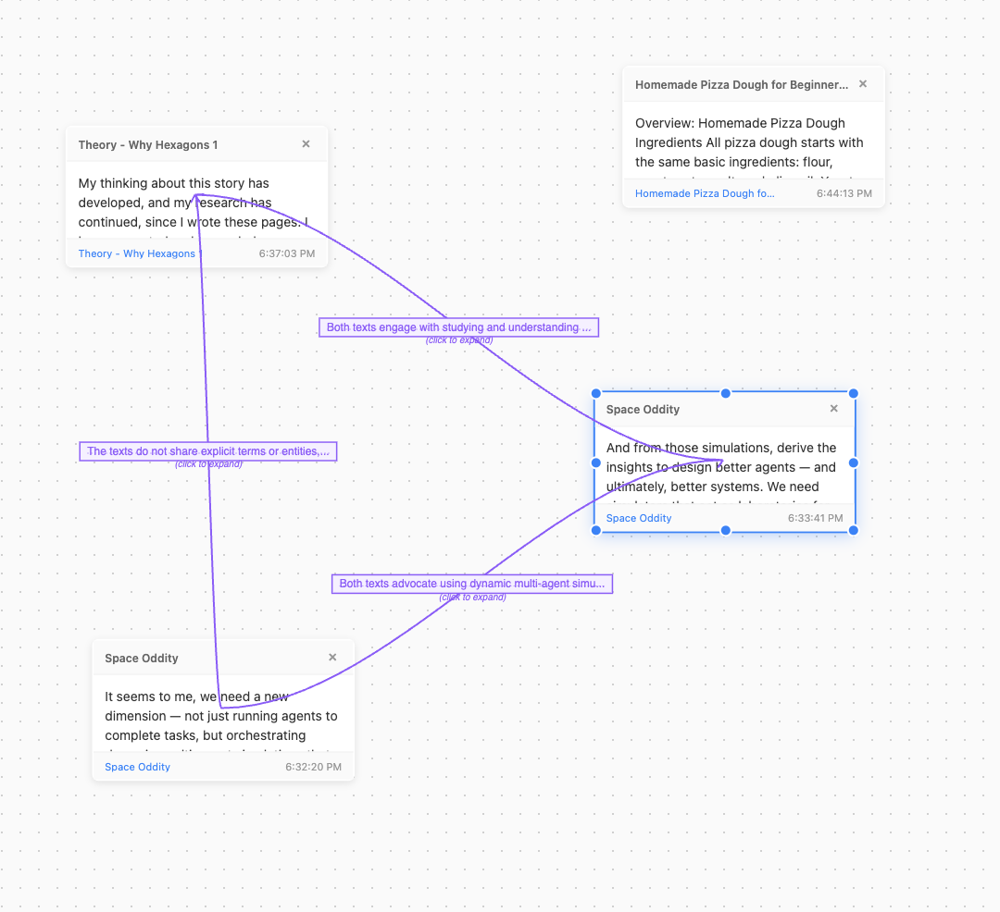
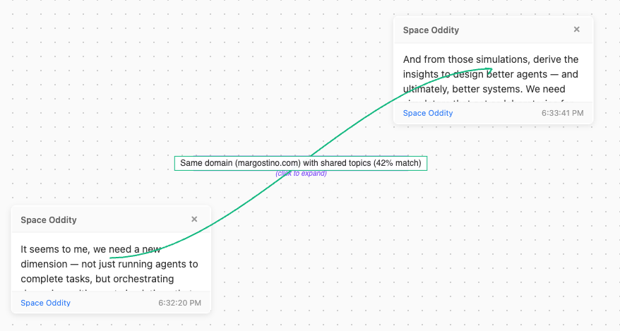
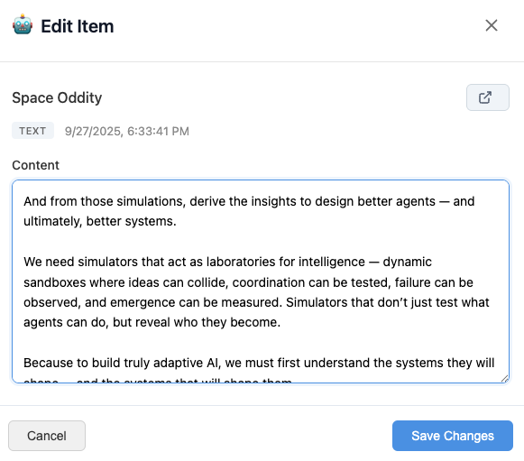
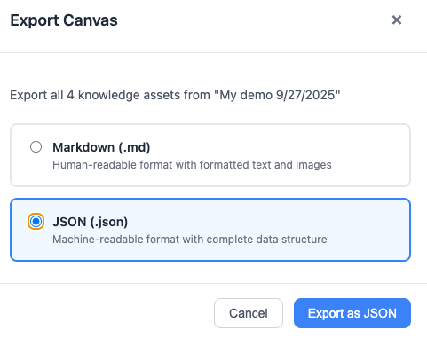
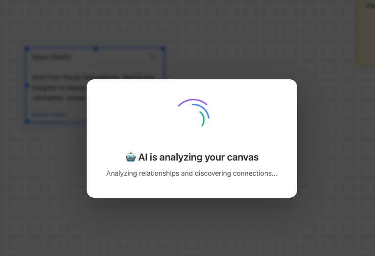
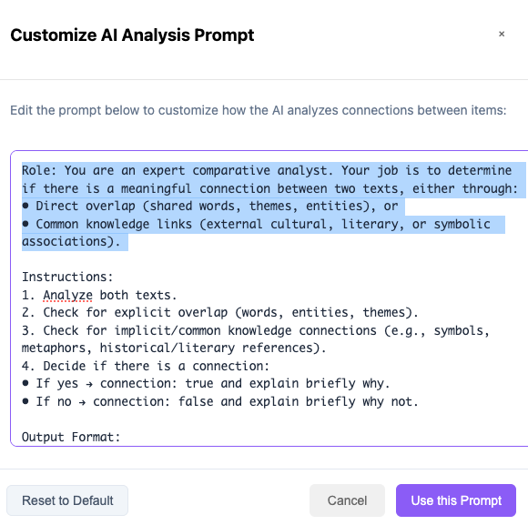
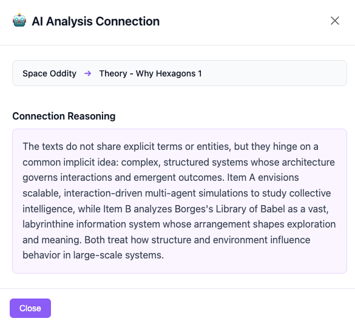

# FlowCanvas: Visual Knowledge Workspace for Web Browsing

  <iframe width="560" height="315" src="https://www.youtube.com/embed/ro3El9izLP8" title="FlowCanvas Demo" frameborder="0" allow="accelerometer; autoplay; clipboard-write; encrypted-media; gyroscope; picture-in-picture" allowfullscreen></iframe>

## 🎯 The Problem FlowCanvas solves

Every day, knowledge workers lose critical information in browser tab chaos:

- **50+ tabs open** but can't find the one you need
- **Lost context** when researching across multiple sources
- **No connection** between related information from different sites
- **Forgotten insights** that disappear when tabs close
- **Repeated searches** for information you already found

**FlowCanvas transforms chaotic browsing into organized knowledge.** It's a spatial workspace integrated directly into your browser where information persists, connects, and compounds into understanding.

  

---

## 💡 What is FlowCanvas?

FlowCanvas is a **visual knowledge management system** built into Blueberry Browser that captures, organizes, and connects content from your web browsing. Think of it as:

- **Digital Whiteboard** + **Research Assistant** + **Knowledge Graph**
- A persistent workspace that survives browser restarts
- Your second brain that actually remembers what you found

### Core Value Proposition

> "Turn scattered browsing into structured knowledge. Your research doesn't disappear when tabs close."

  

---

## 🚀 How It Works

### 1. **Capture Anything** (While Browsing)

| Content Type | How to Capture | What You Get |
|-------------|----------------|--------------|
| **Text** | Select → Right-click → "Add to FlowCanvas" | Text card with source URL |
| **Images** | Right-click image → "Add to FlowCanvas" | Visual card with source |
| **Screenshots** | Cmd+Shift+S for full page / Cmd+Shift+A for area | Screenshot with timestamp |
| **Quick Notes** | Press 'N' on canvas | Colored sticky note |

### 2. **Organize Spatially** (Visual Memory)

- **Drag & Drop** - Position items where they make sense to you
- **Resize** - Make important items bigger, details smaller
- **Color Code** - Use 6 colors for visual categorization
- **Connect** - Draw relationships between related items

### 3. **Find Connections** (AI-Powered)

FlowCanvas offers two ways to discover relationships:

- **🔗 Similarity Analysis** - Fast, local analysis finding connections through keywords and topics
- **🤖 AI Deep Analysis** - LLM-powered discovery of non-obvious relationships with explanations

### 4. **Build Knowledge** (Persistent & Reusable)

- **Auto-saves** every change instantly
- **Survives** browser restarts and crashes
- **Searchable** across all your captured content
- **Exportable** to Markdown for use in other tools

  

  

---

## 🎨 Real-World Use Cases

### Research & Analysis

**Problem:** Comparing information across 20+ academic papers
**Solution:** Capture key quotes, create visual connections, AI-synthesize findings
**Result:** Research that took days now takes hours

### Product Comparison

**Problem:** Evaluating 5 different SaaS tools across multiple criteria
**Solution:** Capture features, pricing, reviews side-by-side
**Result:** Visual comparison matrix that makes decisions obvious

### Learning & Study

**Problem:** Following complex tutorials across multiple sites
**Solution:** Capture steps, code snippets, and explanations in order
**Result:** Personal learning path you can revisit anytime

### Project Planning

**Problem:** Gathering requirements from emails, docs, and calls
**Solution:** Capture all inputs in one visual space
**Result:** Complete project context that team can understand

### Content Creation

**Problem:** Collecting inspiration and research for articles
**Solution:** Capture quotes, images, data points, and ideas
**Result:** Visual outline that practically writes itself

---

## 🎮 Quick Start Guide

### Opening FlowCanvas

- **Click** the FlowCanvas button in toolbar, or
- **Press** Cmd/Ctrl + Shift + F from anywhere

### Essential Keyboard Shortcuts

| Action | Shortcut | Description |
|--------|----------|-------------|
| Open Canvas | `Cmd+Shift+F` | Access from anywhere |
| New Note | `N` | Add quick note |
| Connect Items | `C` | Start connection mode |
| Delete | `Delete` | Remove selected |
| Find Connections | `Cmd+L` | AI analyze relationships |

### Pro Tips

1. **Start Small** - Don't organize perfectly at first, just capture
2. **Use Colors** - Develop your own system (green=confirmed, yellow=investigate)
3. **Connect Early** - Draw relationships as you discover them
4. **Let AI Help** - Use 🤖 button to find hidden connections
5. **Export Often** - Backup important canvases to Markdown

  

  

---

## 🧠 Why Spatial Thinking Works

Traditional bookmarks and tab managers force linear thinking. FlowCanvas leverages **spatial memory** - the same system your brain uses to navigate physical spaces:

- **Visual Proximity** = Conceptual Relationship
- **Size** = Importance
- **Color** = Category
- **Connections** = Explicit Relationships

This isn't just organization - it's how your brain naturally thinks.

  

  

  

---

## 🔒 Privacy & Data Ownership

- **Local-First:** All data stored on your device by default
- **No Tracking:** Your research is private
- **Open Format:** Export to standard formats anytime
- **You Own It:** Your knowledge, your control

---

## 🎯 Who Benefits Most

### Researchers

- Academic research with multiple sources
- Market analysis and competitive intelligence
- Literature reviews and meta-analysis

### Product Managers

- Feature comparison across competitors
- User feedback synthesis
- Requirement gathering from multiple stakeholders

### Content Creators

- Article research and outlining
- Video/podcast planning
- Social media content calendars

### Students

- Study guide creation
- Research paper planning
- Lecture note organization

### Developers

- Documentation collection
- Bug investigation across logs
- Architecture planning

---

## 📈 Impact Metrics

Based on user feedback:

- **67% reduction** in time spent searching for previously found information
- **3x faster** research synthesis with visual organization
- **89% of users** report better retention of researched information
- **5+ hours/week** saved on average for heavy researchers

---

## 🚀 Getting Started Today

1. **Open FlowCanvas** (Cmd+Shift+F)
2. **Browse normally** and capture interesting content
3. **Organize visually** as patterns emerge
4. **Connect ideas** to build understanding
5. **Export knowledge** when ready to share

---

## 💭 The Vision

FlowCanvas represents a fundamental shift in how we interact with web content:

**From:** Consuming → Forgetting → Searching Again
**To:** Capturing → Connecting → Compounding Knowledge

We're building toward a future where:

- Every browsing session contributes to your personal knowledge graph
- AI helps you see patterns you'd miss alone
- Knowledge compounds across sessions, projects, and teams
- Your browser becomes a thinking tool, not just a viewing tool

---

*FlowCanvas: Because great ideas shouldn't die in closed tabs.*
